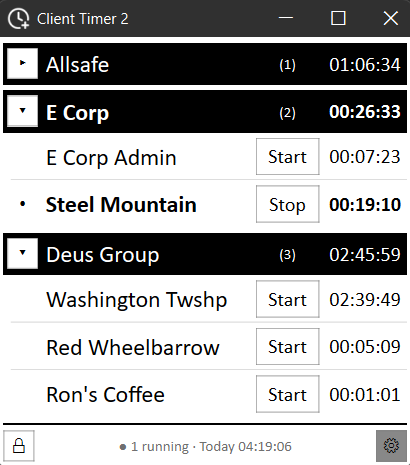

# ClientTimer2

A desktop time tracker for people who bill against a lot of clients and don't want a whole agentic-integrated-production-suite about it. One window, rows of timers and groups, a start button, and an array of app themes. What else could you even need?

**[Download the latest installer here](../../releases/latest)**, or view all releases.



---

## What it does

- **Chess-style start and stop.** Start a timer and every other one stops. Hold Shift to add a second running timer instead.
- **Groups.** Drag clients under collapsible separator rows. Each separator can show its child count and aggregate time, and lights up when anything under it is running.
- **UI lock.** Unlock the UI to rearrange it to your liking, add new timers, delete old ones, etc. Lock it so you don't accidentally break your configuration during daily use.
- **Daily auto-reset (optional).** Pick a time, and every timer zeroes out once per day, even if the app wasn't open when the clock hit. Saved sessions are then available in Settings forever as history.
- **Themes.** Twenty+ hand-built color profiles, from "muted corporate blue" to "I'm edgy and I like my timer to look like a radar".


## Under the hood

- **[Installer](../../releases/latest)** Inno Setup, no elevated permissions required. Installs per-user and updates itself in-app after that.
- **Crash reporting.** Automated crash reporting (with a manual option too) that gets anonymized - all personal data scrubbed before anything leaves the machine.
- **Data.** Plain JSON on disk. Autosaves every few seconds while running.
- **Backups.** Rotating snapshots in a dedicated folder, configurable frequency and retention. One-click to open the folder from settings. CT2 is severely more concerned about data loss than you are.
- **No cloud, no accounts, no telemetry beyond crash reports.** It runs locally and that's the whole point. Every child grew up dreaming of tracking time spent on hold with a customer in peace, and that's what you get.

## Building from source

```
pip install PySide6
python main.py
```

Python 3.12+. Windows only for now BFS for now.

## Stack

Python - PySide6 - Sentry - Inno Setup
